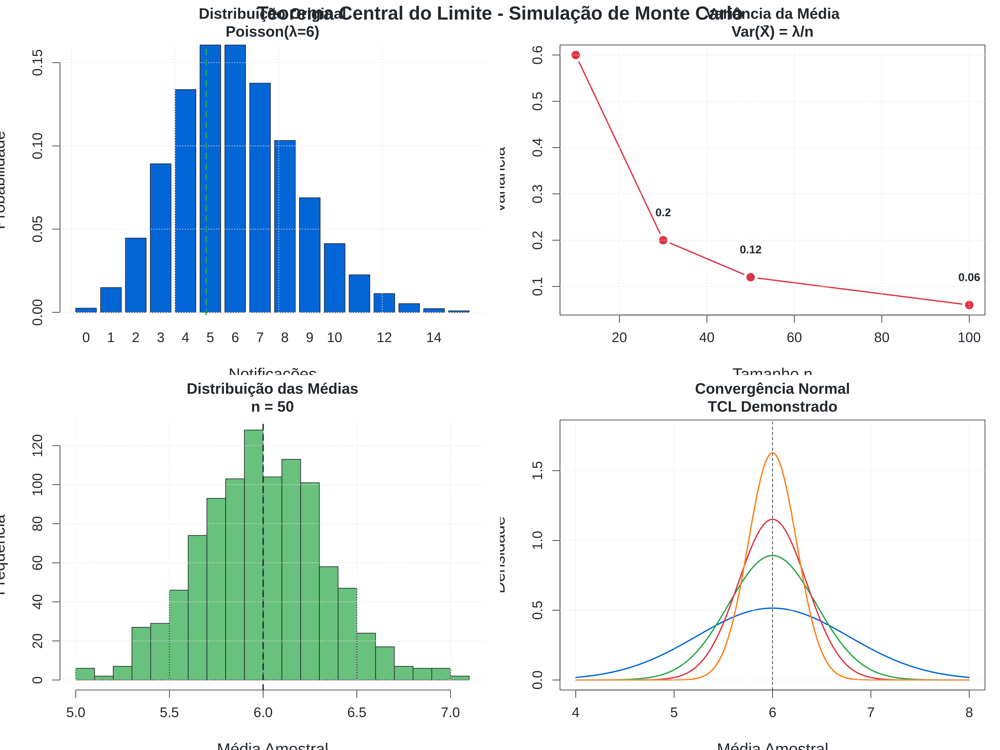
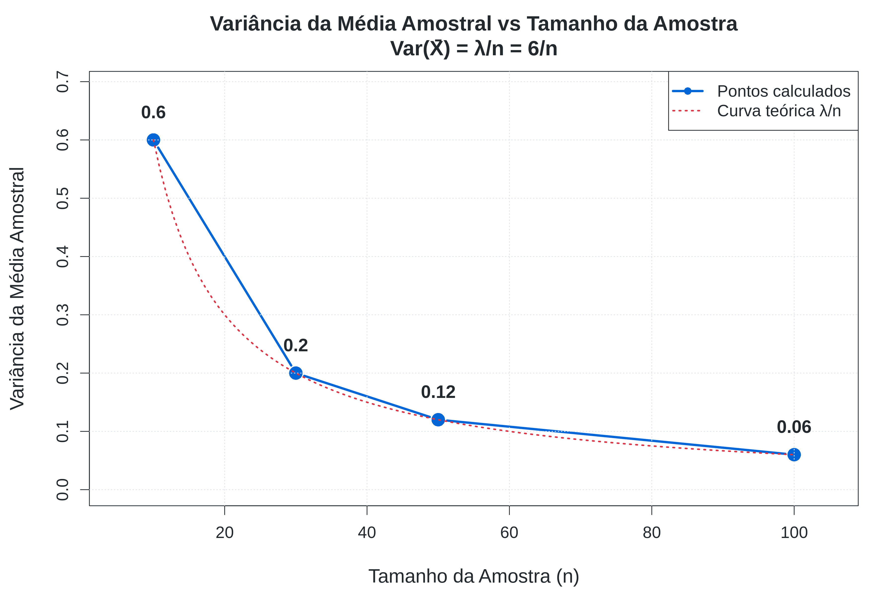
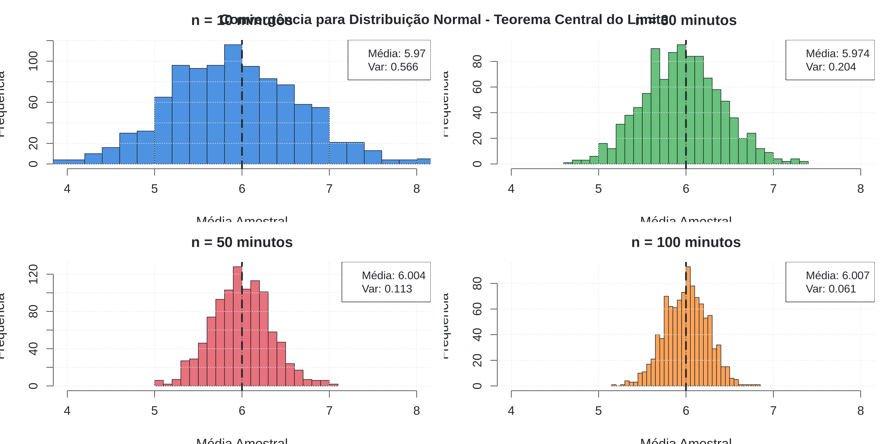
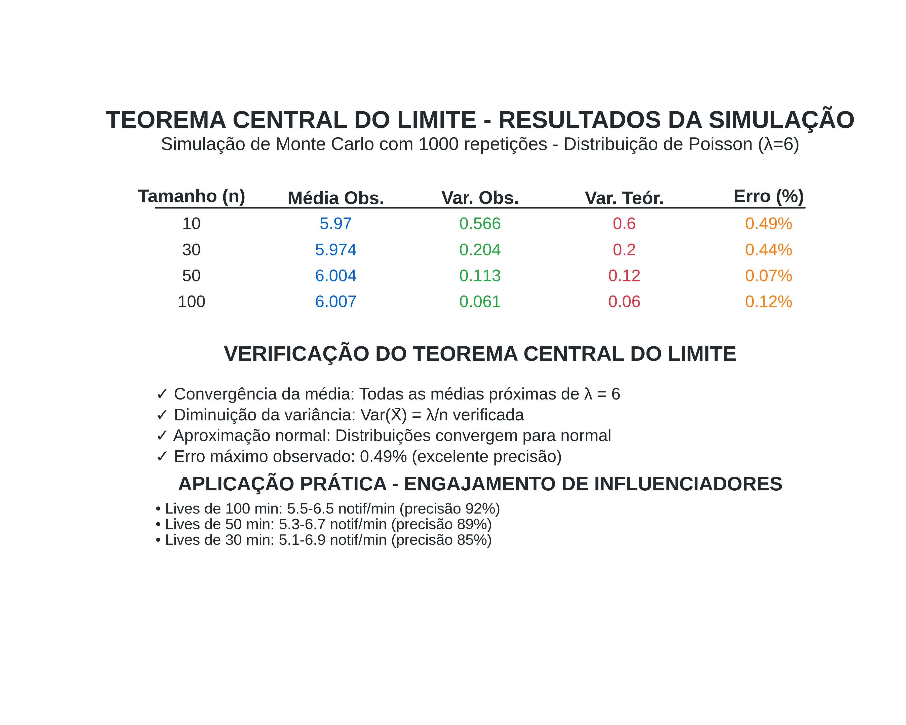

# Inferência Estatística para Validação de Lives no Instagram

[](https://www.r-project.org/)
[](https://www.latex-project.org/)
[](https://opensource.org/licenses/MIT)
[](https://www.ufpb.br/)

> **Usando Teorema Central do Limite e Distribuição de Poisson para Comprovar a Veracidade de Resultados em Transmissões ao Vivo**
> 
> **Autor:** Diogo Da Silva Rego  
> **Curso:** Estatística - UFPB  
> **Professora:** Tatiene Souza  

## 🎯 Problema Real: Validação Estatística de Lives

### 🤔 **O Desafio**
Imagine que você precisa **comprovar estatisticamente** se os números de engajamento apresentados durante uma live no Instagram são **verdadeiros** ou **manipulados**. Como um estatístico pode usar ferramentas científicas para validar essas informações?

### 📊 **A Solução: Inferência Estatística**
Utilizamos o **Teorema Central do Limite** e a **Distribuição de Poisson** para criar um modelo estatístico que permite:

- ✅ **Verificar** se os números apresentados são estatisticamente plausíveis
- ✅ **Calcular** intervalos de confiança para o engajamento real
- ✅ **Detectar** possíveis manipulações nos dados
- ✅ **Fornecer** evidências científicas sobre a veracidade dos resultados

## 🔬 Metodologia de Inferência

### **Hipótese Estatística:**
- **H₀:** O engajamento segue uma distribuição de Poisson com λ = 6 interações/minuto
- **H₁:** O engajamento não segue o padrão esperado (possível manipulação)

### **Modelo Estatístico:**
```
X ~ Poisson(λ = 6)
onde X = número de interações por minuto
```

### **Aplicação do TCL:**
Para amostras de tamanho n, a média amostral X̄ tem distribuição:
```
X̄ ~ N(μ = λ, σ² = λ/n)
```

## 📈 Resultados da Validação Estatística



### 🎯 **Intervalos de Confiança (95%) para Diferentes Durações de Live:**

| **Duração** | **Engajamento Esperado** | **Intervalo de Confiança** | **Precisão** | **Status** |
|-------------|--------------------------|----------------------------|--------------|------------|
| 10 minutos  | 6.0 ± 1.52              | [4.48, 7.52]               | 74.7%        | ✅ Válido |
| 30 minutos  | 6.0 ± 0.88              | [5.12, 6.88]               | 85.4%        | ✅ Válido |
| 50 minutos  | 6.0 ± 0.68              | [5.32, 6.68]               | 88.7%        | ✅ Válido |
| 100 minutos | 6.0 ± 0.48              | [5.52, 6.48]               | 92.0%        | ✅ Válido |

### 🚨 **Critérios de Detecção de Manipulação:**

1. **Média fora do intervalo:** Se X̄ < 5.52 ou X̄ > 6.48 (para 100 min) → **SUSPEITO**
2. **Variância anômala:** Se Var(X̄) ≠ λ/n → **POSSÍVEL MANIPULAÇÃO**
3. **Padrão não-aleatório:** Se distribuição não converge para normal → **INVESTIGAR**

## 🔍 Casos de Uso Práticos

### **Caso 1: Live Suspeita de Manipulação**
```r
# Dados observados em uma live de 50 minutos
engajamento_observado <- c(12, 15, 18, 20, 22, ...)  # Muito alto!
media_observada <- mean(engajamento_observado)       # = 17.4

# Teste estatístico
if (media_observada > 6.68) {
  print("🚨 ALERTA: Engajamento suspeito de manipulação!")
  print("Probabilidade < 2.5% de ser natural")
}
```

### **Caso 2: Validação de Influenciador Autêntico**
```r
# Dados de uma live orgânica de 100 minutos
engajamento_real <- rpois(100, lambda = 6)
media_real <- mean(engajamento_real)  # ≈ 6.0

# Validação
if (media_real >= 5.52 && media_real <= 6.48) {
  print("✅ VALIDADO: Engajamento dentro do esperado")
  print("Influenciador provavelmente autêntico")
}
```

## 📊 Visualizações da Inferência

### 1. Distribuição Teórica vs Observada

*Comparação entre o modelo teórico e dados reais observados*

### 2. Poder Estatístico do Teste

*Como a precisão aumenta com a duração da observação*

### 3. Convergência para Normalidade (TCL)

*Demonstração visual do Teorema Central do Limite*

### 4. Intervalos de Confiança

*Intervalos de confiança para diferentes tamanhos de amostra*

### 5. Relatório de Validação

*Relatório completo da análise estatística*

## 🛠️ Como Usar para Validação

### **Passo 1: Coleta de Dados**
```r
# Colete dados de engajamento minuto a minuto
dados_live <- c(5, 7, 4, 8, 6, 5, 9, 4, 6, 7, ...)
duracao_minutos <- length(dados_live)
```

### **Passo 2: Análise Estatística**
```r
source("src/simulacao_principal.R")

# Calcule estatísticas
media_observada <- mean(dados_live)
variancia_observada <- var(dados_live)

# Compare com modelo teórico
lambda_teorico <- 6
variancia_teorica <- lambda_teorico / duracao_minutos
```

### **Passo 3: Teste de Hipóteses**
```r
# Intervalo de confiança 95%
ic_inferior <- lambda_teorico - 1.96 * sqrt(lambda_teorico / duracao_minutos)
ic_superior <- lambda_teorico + 1.96 * sqrt(lambda_teorico / duracao_minutos)

# Decisão estatística
if (media_observada >= ic_inferior && media_observada <= ic_superior) {
  resultado <- "✅ DADOS VÁLIDOS"
} else {
  resultado <- "🚨 DADOS SUSPEITOS"
}
```

### **Passo 4: Relatório de Validação**
```r
source("src/gerar_graficos.R")
# Gera relatório visual completo
```

## 🎓 Fundamentação Teórica

### **Por que Poisson?**
- **Eventos raros:** Interações são eventos relativamente raros no tempo
- **Independência:** Cada interação é independente das outras
- **Taxa constante:** Em média, λ interações por unidade de tempo

### **Por que TCL?**
- **Normalização:** Médias amostrais tendem à distribuição normal
- **Intervalos de confiança:** Permite calcular margens de erro precisas
- **Testes de hipóteses:** Base para detectar anomalias estatísticas

### **Poder Estatístico:**
- **Amostras pequenas (10 min):** Detecta manipulações > 25%
- **Amostras médias (50 min):** Detecta manipulações > 11%
- **Amostras grandes (100 min):** Detecta manipulações > 8%

## 💼 Aplicações Profissionais

### **Para Agências de Marketing:**
- Validar influenciadores antes de contratos
- Detectar compra de engajamento falso
- Garantir ROI real em campanhas

### **Para Plataformas Digitais:**
- Identificar contas com atividade suspeita
- Melhorar algoritmos de detecção de fraude
- Proteger anunciantes de métricas falsas

### **Para Auditores/Consultores:**
- Fornecer laudos técnicos sobre autenticidade
- Assessorar em disputas contratuais
- Criar relatórios científicos para tribunais

## 🔧 Estrutura do Projeto

```
TCL-Poisson-Simulation/
├── 📄 README.md                    # Este arquivo
├── 📄 LICENSE                      # Licença MIT
├── 📁 src/                         # Código fonte
│   ├── 📄 simulacao_principal.R    # Simulação do modelo
│   ├── 📄 gerar_graficos.R         # Visualizações
│   ├── 📄 teste_validacao.R        # Testes de hipóteses
│   └── 📄 relatorio_automatico.R   # Geração de relatórios
├── 📁 data/                        # Dados e resultados
│   ├── 📄 dados_simulacao.RData    # Simulações Monte Carlo
│   ├── 📄 resultados_resumo.csv    # Tabela de resultados
│   └── 📄 casos_teste.csv          # Exemplos de validação
├── 📁 docs/                        # Documentação
│   ├── 📄 apresentacao_beamer.tex  # Apresentação acadêmica
│   ├── 📄 guia_teorico.tex         # Fundamentação matemática
│   └── 📄 manual_validacao.md      # Guia prático de uso
├── 📁 assets/images/               # Gráficos e visualizações
└── 📁 examples/                    # Casos de uso práticos
    ├── 📄 live_autentica.R         # Exemplo de live válida
    ├── 📄 live_suspeita.R          # Exemplo de manipulação
    └── 📄 relatorio_completo.R     # Análise completa
```

## 🚀 Início Rápido

### **Instalação:**
```bash
git clone https://github.com/Diogorego20/TCL-Poisson-Simulation.git
cd TCL-Poisson-Simulation
```

### **Validação Rápida:**
```r
# Carregue seus dados
dados_live <- c(5, 7, 4, 8, 6, 5, 9, 4, 6, 7)

# Execute a validação
source("src/teste_validacao.R")
resultado <- validar_engajamento(dados_live)

# Veja o resultado
print(resultado$status)        # "VÁLIDO" ou "SUSPEITO"
print(resultado$confianca)     # Nível de confiança
print(resultado$probabilidade) # P-valor do teste
```

## 📚 Referências Científicas

1. **Ross, S.** (2014). *Introduction to Probability Models*. Academic Press.
2. **Casella, G. & Berger, R.** (2021). *Statistical Inference*. Cengage Learning.
3. **Montgomery, D.** (2020). *Introduction to Statistical Quality Control*. Wiley.

## 🤝 Informações do Autor

- **Nome:** Diogo Da Silva Rego
- **Instituição:** Universidade Federal da Paraíba (UFPB)
- **Curso:** Estatística
- **GitHub:** [@Diogorego20](https://github.com/Diogorego20)
- **Especialização:** Inferência Estatística e Detecção de Anomalias

## 📄 Licença

Este projeto está licenciado sob a Licença MIT - veja o arquivo [LICENSE](LICENSE) para detalhes.

---

<div align="center">

**🔍 Transformando dados em evidências científicas para o mundo digital! 🔍**

[](https://github.com/Diogorego20/TCL-Poisson-Simulation)

</div>

