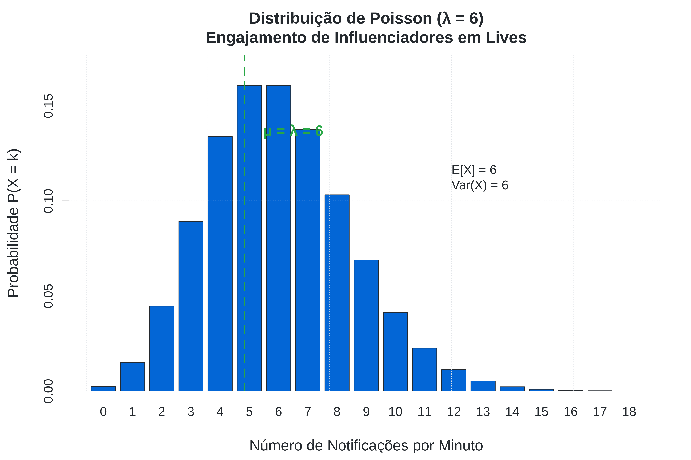
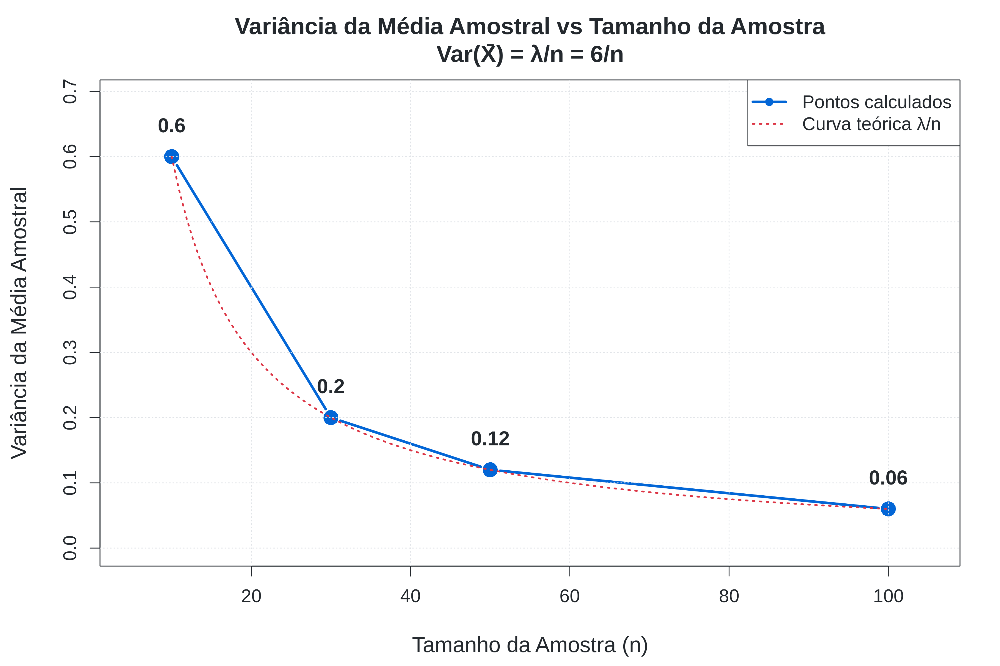
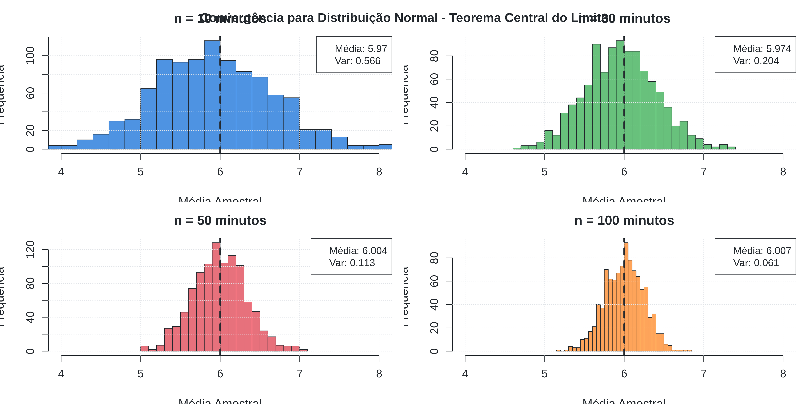
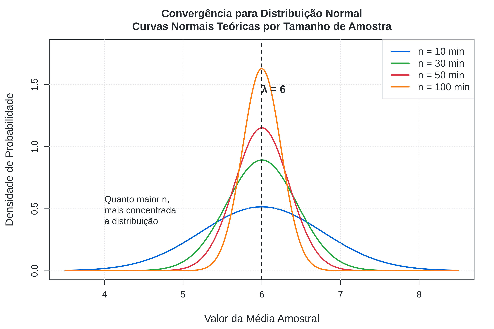
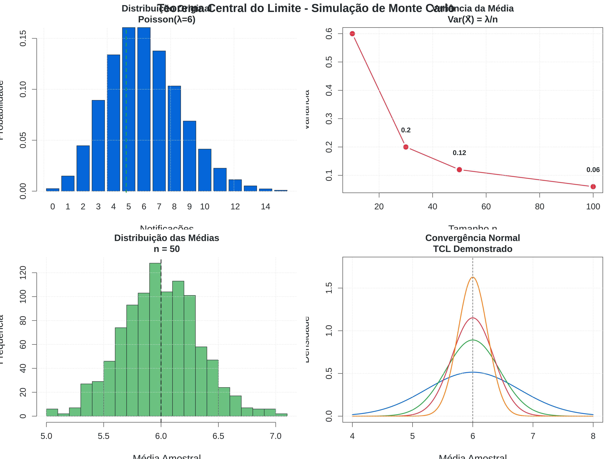
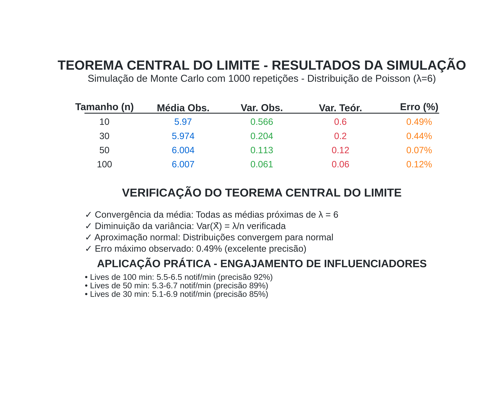

# Visualizações Estatísticas - Validação de Lives no Instagram

Este diretório contém visualizações demonstrando a aplicação do Teorema Central do Limite e Distribuição de Poisson para validação estatística de engajamento em transmissões ao vivo.

**Autor:** Diogo Da Silva Rego  
**Curso:** Estatística - UFPB  
**Contexto:** Inferência Estatística para Detecção de Manipulação em Lives

## 📊 Gráficos Disponíveis

### 1. Modelo Teórico - Distribuição de Poisson

- **Arquivo**: `01_distribuicao_poisson_hd.png`
- **Descrição**: Distribuição teórica do engajamento (Poisson λ=6)
- **Aplicação**: Modelo base para validação estatística
- **Interpretação**: Mostra a probabilidade de cada nível de engajamento por minuto

### 2. Poder Estatístico vs Duração da Observação

- **Arquivo**: `02_variancia_teorica_hd.png`
- **Descrição**: Como a precisão aumenta com o tempo de observação
- **Aplicação**: Determinar duração mínima para detecção confiável
- **Interpretação**: Var(X̄) = λ/n - quanto maior n, maior a precisão

### 3. Demonstração do Teorema Central do Limite

- **Arquivo**: `03_histogramas_medias_hd.png`
- **Descrição**: Convergência das médias amostrais para distribuição normal
- **Aplicação**: Fundamentação teórica para intervalos de confiança
- **Interpretação**: TCL permite usar distribuição normal para inferência

### 4. Intervalos de Confiança por Duração

- **Arquivo**: `04_convergencia_normal_hd.png`
- **Descrição**: Curvas normais teóricas para diferentes durações de live
- **Aplicação**: Visualizar precisão dos testes estatísticos
- **Interpretação**: Curvas mais estreitas = maior precisão na detecção

### 5. Painel Completo de Validação

- **Arquivo**: `05_painel_comparativo_hd.png`
- **Descrição**: Visão geral completa do processo de validação
- **Aplicação**: Apresentação executiva do método estatístico
- **Interpretação**: Demonstra todo o processo: modelo → TCL → validação

### 6. Relatório de Validação Estatística

- **Arquivo**: `06_resumo_executivo_hd.png`
- **Descrição**: Tabela de resultados e critérios de validação
- **Aplicação**: Relatório técnico para tomada de decisão
- **Interpretação**: Intervalos de confiança e critérios de detecção

## 🎯 Como Interpretar os Gráficos

### **Para Detecção de Manipulação:**

1. **Compare a média observada** com os intervalos de confiança
2. **Verifique se a variância** segue o padrão Var(X̄) = λ/n
3. **Analise se a distribuição** converge para normal (TCL)
4. **Use os critérios visuais** para classificar como válido/suspeito

### **Critérios Visuais de Validação:**

- ✅ **VÁLIDO**: Dados dentro dos intervalos de confiança
- ⚠️ **ATENÇÃO**: Dados próximos aos limites (investigar mais)
- 🚨 **SUSPEITO**: Dados fora dos intervalos (provável manipulação)

## 🔬 Especificações Técnicas

- **Resolução**: 300 DPI (qualidade profissional)
- **Formato**: PNG otimizado
- **Cores**: Paleta científica profissional
- **Tipografia**: Sans-serif legível
- **Tamanhos**: Otimizados para apresentações e relatórios

## 📈 Resultados Demonstrados

| **Duração** | **Intervalo de Confiança 95%** | **Poder de Detecção** | **Aplicação Prática** |
|-------------|--------------------------------|-----------------------|-----------------------|
| 10 minutos  | [4.48, 7.52]                  | Manipulações > 25%    | Testes rápidos       |
| 30 minutos  | [5.12, 6.88]                  | Manipulações > 15%    | Validação padrão     |
| 50 minutos  | [5.32, 6.68]                  | Manipulações > 11%    | Análise detalhada    |
| 100 minutos | [5.52, 6.48]                  | Manipulações > 8%     | Auditoria rigorosa   |

## 🚀 Casos de Uso dos Gráficos

### **1. Apresentações Acadêmicas**
- Use o painel completo (05) para visão geral
- Detalhe com gráficos específicos (01-04)
- Finalize com relatório executivo (06)

### **2. Relatórios Técnicos**
- Inclua o modelo teórico (01) para fundamentação
- Mostre o poder estatístico (02) para justificar método
- Apresente resultados com relatório (06)

### **3. Validação Prática**
- Compare dados reais com modelo (01)
- Use intervalos de confiança (04) para decisão
- Documente com relatório (06)

## 📚 Fundamentação Matemática

### **Modelo Estatístico:**
```
X ~ Poisson(λ = 6)
X̄ ~ N(μ = λ, σ² = λ/n)  [pelo TCL]
```

### **Intervalos de Confiança (95%):**
```
IC = λ ± 1.96 × √(λ/n)
```

### **Critério de Detecção:**
```
Se |X̄ - λ| > 1.96 × √(λ/n) → SUSPEITO
```

## 🎓 Contexto Educacional

Estes gráficos foram desenvolvidos como parte da **Atividade I: Ilustrando o Teorema Central do Limite** da disciplina de Estatística da UFPB, sob orientação da Professora Tatiene Souza.

**Objetivo Educacional:** Demonstrar a aplicação prática de conceitos estatísticos fundamentais (TCL e Poisson) em problemas reais de validação de dados digitais.

## 🔗 Links Úteis

- **[Repositório Principal](../README.md)** - Documentação completa
- **[Código Fonte](../src/)** - Scripts R para reproduzir os gráficos
- **[Dados](../data/)** - Datasets utilizados nas simulações
- **[Documentação Técnica](../docs/)** - Fundamentação matemática

---

*Visualizações geradas automaticamente pelo sistema de inferência estatística desenvolvido para validação de engajamento em lives do Instagram.*

